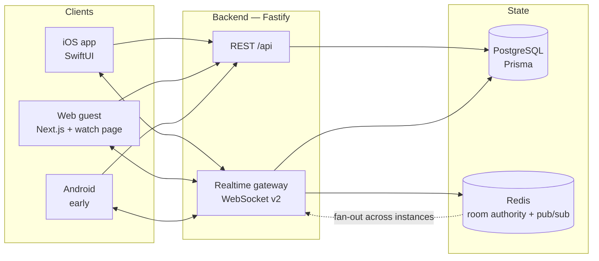

<div align="center">


**Watch together, in sync — from anywhere.**

Synchronized co-watching for iOS and the web: one host, one timeline,
sub-second drift, and a room your friends join by tapping a link.

[](https://github.com/PubgmHacker/plink/actions/workflows/ci.yml)
[](ios/)
[](ios/)
[](backend/)
[](LICENSE)

</div>

---

## What Plink is

A watch party product built around one hard problem: **keeping several devices on the
same frame of the same video without anyone babysitting the scrubber.**

Plink's answer is a host-authoritative timeline. One participant owns playback
position; every other client continuously reconciles against it and shows the user
exactly how far off they are — the drift badge (`in sync · 42 ms`) is a first-class
part of the interface, not a debug overlay.

|                              |                                                                                      |
| ---------------------------- | ------------------------------------------------------------------------------------ |
| **Platforms**                | iOS 17+ (SwiftUI), web guest player, Android client (early)                          |
| **Sources that play in-app** | YouTube, VK Video, Rutube, direct media URLs                                         |
| **Sources via screen share** | Everything else — no DRM circumvention, ever                                         |
| **Locales**                  | Russian (default), English — [localization guide](docs/architecture/localization.md) |
| **Realtime**                 | WebSocket protocol v2, Redis-backed authority, monotonic sequencing                  |

## Repository layout

```
plink/
├── ios/            SwiftUI client — project generated by XcodeGen from project.yml
│   ├── Plink/          app sources (feature modules, design system, realtime client)
│   ├── PlinkTests/     unit + snapshot tests
│   ├── PlinkUITests/   funnel smoke tests
│   ├── PlinkWidget/    home-screen widget
│   └── android-client/ Kotlin client (early, CI-verified build only)
├── backend/        Fastify API + realtime gateway (Prisma, PostgreSQL, Redis)
├── landing/        Next.js marketing site and web join flow
├── brand/          shipped brand assets (see brand/README.md)
└── docs/           architecture, decisions, runbooks, QA — start at docs/README.md
```

## Architecture at a glance



Room state lives in Redis and is mutated through Lua scripts, so a command either
applies wholly or not at all. Every state change carries a monotonic `seq` and an
`epoch`; commands from a superseded host are rejected by epoch rather than by
guesswork. Client actions carry an `actionId` and are idempotent on retry.

Deeper reading: [architecture overview](docs/architecture/README.md) ·
[realtime protocol](docs/architecture/realtime-protocol.md) ·
[decision log](docs/adr/README.md)

## Getting started

Prerequisites: **Node 20**, **PostgreSQL 16**, **Redis 7**, and for the iOS client
**Xcode 16** with [XcodeGen](https://github.com/yonaskolb/XcodeGen)
(`brew install xcodegen`).

```bash
git clone https://github.com/PubgmHacker/plink.git
cd plink
make setup          # installs backend + landing dependencies, generates the Xcode project
```

### Backend

```bash
cd backend
cp .env.example .env          # then fill in DATABASE_URL and REDIS_URL
npm run prisma:migrate        # apply migrations to your local database
npm run dev                   # http://localhost:8080
```

Verify it is up:

```bash
curl localhost:8080/health/ready
```

| Endpoint            | Purpose                                                     |
| ------------------- | ----------------------------------------------------------- |
| `GET /health/live`  | Liveness — process is running. Used by Railway.             |
| `GET /health/ready` | Readiness — PostgreSQL and Redis both reachable.            |
| `GET /health`       | Aggregate health with dependency detail.                    |
| `GET /metrics`      | Prometheus metrics. Requires `METRICS_TOKEN` in production. |

The REST surface is documented in [`docs/architecture/api.md`](docs/architecture/api.md).

### iOS client

```bash
cd ios
cp Secrets.xcconfig.template Secrets.xcconfig   # optional; AI and Yandex features stay off without it
xcodegen generate
open Plink.xcodeproj
```

`Plink.xcodeproj` is **generated and not committed** — edit
[`ios/project.yml`](ios/project.yml) instead, never the project file.
Signing uses team `2QAMUC4Z4P` with automatic provisioning, already declared in
`project.yml`. See the [iOS build runbook](docs/runbooks/ios-build-and-release.md)
for device installs, TestFlight, and App Store submission.

### Landing

```bash
cd landing
npm run dev                   # http://localhost:3000
```

## Everyday commands

Run from the repository root:

```bash
make help           # list every target
make lint           # ESLint + Prettier + SwiftLint across all three systems
make format         # apply formatting fixes
make typecheck      # tsc --noEmit for backend and landing
make test           # backend suite (Redis-backed tests included when Redis is up)
make ios            # generate the Xcode project and build for the simulator
make check          # everything CI runs, in the order CI runs it
```

`make check` is the gate to run before opening a pull request. CI runs the same
steps, so a green local `check` is a green pipeline in almost every case.

## Configuration

Every environment variable is declared and documented in
[`backend/.env.example`](backend/.env.example). Configuration is parsed and
validated once at boot; the process refuses to start on a missing or malformed
value rather than failing later at request time.

Production additionally refuses to boot on a weak or default `JWT_SECRET`, on
`CORS_ORIGIN="*"` combined with credentials, and without `REDIS_URL`. The rationale
is recorded in [ADR-0006](docs/adr/0006-fail-fast-configuration.md).

## Testing

```bash
cd backend
npm test                  # full suite
npm run test:integration  # Redis-backed tests only (requires REDIS_URL)
npm run test:coverage     # coverage report with enforced thresholds
```

The suite includes **contract parity tests** that compare the TypeScript realtime
schemas against the Swift client's decoders, so a protocol change that lands on one
side and not the other fails CI instead of production.
[Testing strategy](docs/qa/testing-strategy.md).

## Deployment

`backend/` deploys to Railway from `backend/Dockerfile`; configuration lives in
[`backend/railway.json`](backend/railway.json). The landing site and web join flow
are served by the same service. Release steps, rollback procedure, and the
post-deploy checklist are in the
[deployment runbook](docs/runbooks/deployment.md).

## Contributing

Read [CONTRIBUTING.md](CONTRIBUTING.md) first — it covers branch naming, commit
format (Conventional Commits), the review bar, and the code style each system
enforces. Security reports go through [SECURITY.md](SECURITY.md), never a public
issue.

## License

Proprietary. See [LICENSE](LICENSE). All rights reserved.
