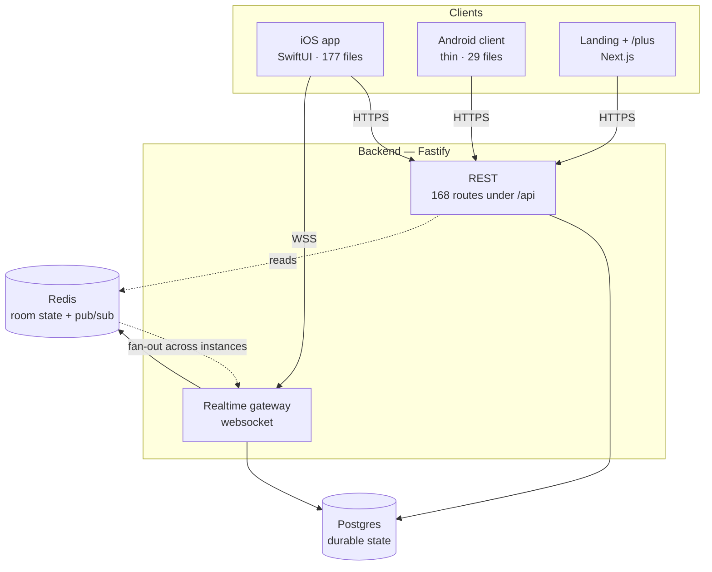

# Architecture overview

How Plink is put together, for someone who has just cloned the repository. This page is
present tense and describes what exists today; the reasons behind the choices are in the
[decision log](../adr/README.md), and anything that reads like history belongs there
rather than here.

## What it is

Plink is a watch-together app. One person opens a room, others join by link, and
everyone sees the same video at the same position. The hard part is not the video; it is
that "the same position" has to survive a bad network, a backgrounded app, a host who
seeks, and a participant who joins forty minutes late.

Everything below exists to serve that one sentence.

## The four surfaces



| Surface | Where | What it is |
| ------- | ----- | ---------- |
| iOS app | [`ios/Plink/`](../../ios/Plink/) | The product. SwiftUI, ~57k lines. Project generated by XcodeGen ([ADR-0007](../adr/0007-generated-xcode-project.md)). |
| Backend | [`backend/src/`](../../backend/src/) | Fastify + Prisma, ~23k lines. Serves the REST API, the websocket gateway, and the public web pages. |
| Landing | [`landing/`](../../landing/) | Next.js marketing site and the `/plus` purchase page. ~2k lines, no tests. |
| Android client | [`ios/android-client/`](../../ios/android-client/) | Deliberately thin, ~3k lines. It exists so an Android user can open a share link and watch; it is not feature-parity with iOS. |

The Android client living under `ios/` is an accident of history, not a design. It is
listed here because a newcomer will otherwise not find it.

## Where state lives

Two stores, with a strict division of responsibility.

**Postgres** holds everything durable: users, rooms as records, friendships, messages,
subscriptions, audit rows. Accessed only through Prisma. Migrations are applied SQL and
are never edited after the fact.

**Redis** is the authority for live room state — who is in the room right now, what is
playing, the position, the queue. This is [ADR-0009](../adr/0009-redis-as-room-state-authority.md),
and it is the decision with the widest blast radius on this page: it is why the backend
can run more than one instance, and it is why the realtime gateway is not constructed at
all when Redis is unavailable. The server logs a warning and serves REST without
realtime rather than pretending.

The corollary a newcomer needs early: **do not add live room state to Postgres.** A
room's participant list in a table looks harmless and breaks horizontal scaling the
first time two instances disagree about it.

## The two request paths

### REST

168 routes, all under `/api` except the public web pages. Bearer token in the
`Authorization` header, and — this is the part that surprises people — the token's
claims are not trusted for authorization. Every authenticated request reconciles the
user against Postgres behind a 30-second cache, so a ban or a demotion takes effect
within 30 seconds rather than at token expiry
([ADR-0011](../adr/0011-authorization-state-read-from-the-database.md)).

Full surface, auth posture per route, and the error contract: [API reference](api.md).

### Realtime

A websocket per client, authenticated with a single-use ticket from `POST
/api/realtime/ticket` rather than a bearer header. The gateway
([`backend/src/realtime/`](../../backend/src/realtime/), 8 modules) owns connection
registry, heartbeat, message routing, and the room state and queue stores. Cross-instance
fan-out goes through Redis pub/sub, which is what lets two clients on different backend
instances see the same room.

Message shapes are a versioned contract with the Swift client, and the parity between
the two is enforced by a test that parses the Swift decoder rather than trusting a
hand-written list. Details: [realtime protocol](realtime-protocol.md).

## Playback is host-authoritative

The host's player is the clock. Participants do not negotiate a position between
themselves; they follow the host and correct toward it
([ADR-0002](../adr/0002-host-authoritative-playback.md)). Drift between a participant
and the host is measured, reported, and shown to the user rather than hidden
([ADR-0005](../adr/0005-drift-as-a-user-facing-metric.md)) — a sync app that silently
drifts is a sync app nobody trusts.

The client side of this lives in [`ios/Plink/Playback/`](../../ios/Plink/Playback/) (13
files); the drift samples land at `POST /api/telemetry/sync-sample`.

## Repository layout

```
.
├── ios/                     iOS app, Android client, and the Xcode project generator
│   ├── Plink/               the app
│   ├── PlinkTests/          450 XCTest tests (CI runs these, but only on ios/ changes)
│   ├── android-client/      thin Android client
│   └── project.yml          XcodeGen input; the .xcodeproj is generated and gitignored
├── backend/
│   ├── src/routes/          20 modules, 168 REST routes
│   ├── src/realtime/        websocket gateway, room state, pub/sub
│   ├── src/contracts/       shapes shared with the clients
│   ├── src/services/        12 service modules
│   ├── src/tests/           unit · contract · integration
│   └── prisma/              schema and applied migrations
├── landing/                 Next.js marketing site and /plus
├── docs/                    this tree
├── brand/                   logo system; explorations/ holds superseded rounds
└── Makefile                 the entry point for build, lint and format targets
```

### Finding your way around `ios/Plink/`

The directory names carry version numbers, which is the single most confusing thing
about this codebase on first contact. What the numbers mean:

| Directory | Files | What it holds |
| --------- | ----: | ------------- |
| `Features/` | 42 | Feature-scoped views and their state. The largest directory and the usual place to start. |
| `Services/` | 24 | API client wrappers, persistence, push, presence. |
| `V4/`, `V5/` | 22, 7 | Two generations of shared UI. `V4/` is the live one: it declares `enum V4` (the design-token namespace, in `V4Theme.swift`) and is referenced 84 times from `Features/` and `Views/`. `V5/` is a later generation that was never finished — four of its seven types are used nowhere outside `V5/`. |
| `Views/` | 20 | Screens predating the `Features/` split. |
| `Playback/` | 13 | Player, position correction, drift measurement. |
| `Models/` | 11 | Domain types shared across features. |
| `Design/` | 8 | Design tokens. The only source of colour, spacing and type ([ADR-0010](../adr/0010-design-tokens-as-the-only-style-source.md)). |
| `Realtime/` | 7 | Websocket client and the message envelope. |
| `AppShell/` | 4 | App entry, dependency wiring, navigation sections. |
| `RTC/` | 3 | Voice chat. Currently a stub — see below. |

If you are adding a screen, it goes in `Features/`. If you are adding a colour, you are
probably not — read ADR-0010 first. If you are reaching for something in `V5/`, check
whether anything else uses it before building on it.

### Voice chat is not shipped

`RTC/` and `backend/src/routes/livekit.ts` exist, and neither one carries voice today.
`RoomRTCController` is a deliberate stub with no LiveKit dependency; the SDK is
commented out of `ios/project.yml`; `LIVEKIT_SFU` is `false` in production, so `POST
/api/rtc/token` answers 503; and the voice UI is hidden on every platform.

It is documented here rather than deleted because the plumbing is real and the reasons
it was switched off are specific: LiveKit's `Room` class collides with Plink's own `Room`
struct, and the SDK's participant API moved out from under the integration. Re-enabling
it means importing `LiveKit.Room` qualified and porting to the current publish/unpublish
API — not just flipping the flag. This is the [honest service
catalog](../adr/0003-honest-service-catalog.md) rule applied to the codebase: a feature
that does not work is not presented as if it does.

## Conventions worth knowing before your first change

- **English in code, comments, docs and commits** ([ADR-0001](../adr/0001-english-as-the-engineering-language.md)).
  User-facing copy is Russian, and it is output only: never branch on it. See
  [localization](localization.md).
- **Configuration fails fast.** `backend/src/config/index.ts` validates the environment
  at module scope and throws ([ADR-0006](../adr/0006-fail-fast-configuration.md)). This
  has a consequence for tests that catches everyone once — see the [testing
  strategy](../qa/testing-strategy.md).
- **The service catalog is honest.** A service appears in the app only if it actually
  works ([ADR-0003](../adr/0003-honest-service-catalog.md)).
- **Host matching is strict** and goes through `PlinkHost`, not string comparison
  ([ADR-0004](../adr/0004-strict-host-matching.md)). CI enforces this.
- **The bundle identifier is `com.syncwatch.plink`** and does not match the product
  name. Changing it is not a cleanup, it is a migration
  ([ADR-0008](../adr/0008-legacy-bundle-identifier.md)).

## Where to go next

| You want to… | Read |
| ------------ | ---- |
| Make your first change | [CONTRIBUTING.md](../../CONTRIBUTING.md) |
| Touch sync, the gateway, or message shapes | [Realtime protocol](realtime-protocol.md) |
| Call or extend the API | [API reference](api.md) |
| Add or change user-facing text | [Localization](localization.md) |
| Write or review a test | [Testing strategy](../qa/testing-strategy.md) |
| Deploy, release, or handle an incident | [Runbooks](../runbooks/) |
| Understand why something is the way it is | [Decision log](../adr/README.md) |
