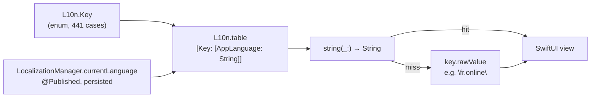

# Localization

Plink ships in Russian first and switches language in-app, not from the system
locale. This page describes the mechanism that is live today, the numbers that say
how far it reaches, and the rule for adding a string.

For why the codebase itself is English while the product is Russian, see
[ADR-0001](../adr/0001-english-as-the-engineering-language.md).

## The mechanism

There is one string catalog, and it is Swift: `L10n` in
[`ios/Plink/Localization/LocalizationManager.swift`](../../ios/Plink/Localization/LocalizationManager.swift).



Four things follow from that shape, and all four are deliberate:

**The catalog is compiled in, not loaded.** `L10n.table` is a Swift dictionary
literal. A missing key is a compile error rather than a runtime blank, and there is
no bundle lookup to get wrong. The cost is that the file is 2,235 lines and that
translators cannot touch it without touching Swift — see [Adding a
string](#adding-a-string).

**Language is app state, not system state.** `LocalizationManager.currentLanguage`
is `@Published` and persisted to `UserDefaults` under `plink_app_language`, so
changing it re-renders every observing view immediately. This is why a Russian user
on an English phone gets Russian, and why the language picker in Settings works
without a relaunch.

**Reads off the main actor go through `LanguageReader`.** `LocalizationManager` is
`@MainActor`. Enum computed properties and other non-isolated call sites use
`LocalizationManager.sharedSafe`, which reads the same `UserDefaults` key directly
and is `Sendable`. Do not reach for `MainActor.assumeIsolated` to get around the
isolation — it traps when the property is read from a background context, and
several of these are.

**A miss renders the key.** `string(_:)` falls back to `key.rawValue`, so an
untranslated string appears in the UI as `fr.online` rather than as empty space.
That is intentional: a visible key gets reported, and a blank label does not.

## Languages

| Language | `AppLanguage` | Code | Status                     |
| -------- | ------------- | ---- | -------------------------- |
| Russian  | `.russian`    | `ru` | Default, and the fallback  |
| English  | `.english`    | `en` | Complete in the catalog    |
| Chinese  | `.chinese`    | `zh` | Complete in the catalog    |

"Complete in the catalog" means every one of the 441 keys has all three
translations — there are no partial rows. It does **not** mean the app is fully
translated, which is the next section.

## How far it actually reaches

These numbers are the point of this page. Measure them again before trusting them;
the commands are below.

| Measure                                                | Count |
| ------------------------------------------------------ | ----: |
| Keys in the catalog, each with all three languages      |   441 |
| Keys actually referenced by UI code                     |   184 |
| Keys translated but referenced nowhere                  |   257 |
| Call sites through the catalog, across 26 files         |   198 |
| **Russian string literals hardcoded in views, across 97 files** | **1,204** |

So the catalog is complete and correct, and roughly 42% of it is wired up. The
Plink+ paywall, the service picker and the settings tree read from it. Most of the
rest of the UI — profile rows, the DM chat, the friends list, the auth screen —
holds Russian literals inline, which means switching to English or Chinese today
leaves large parts of the app in Russian.

That is debt, recorded rather than hidden, and it is the reason
[CONTRIBUTING.md](../../CONTRIBUTING.md) states the rule as "new copy goes through
the catalog" rather than claiming the app is localized.

Re-measure with:

```bash
# Catalog size and coverage
grep -cE '^\s+case \w+ = "' ios/Plink/Localization/LocalizationManager.swift

# Hardcoded Russian literals outside the catalog
grep -rn '"[^"]*[А-Яа-яЁё]' ios/Plink --include='*.swift' \
  | grep -v '^ios/Plink/Localization/' | wc -l

# Call sites, and the distinct keys they reach. Match on `.string(.` rather than on
# a receiver name: the accessor is reached through four different spellings
# (`shared.`, `L.`, `l.`, `loc.`), so grepping for any one of them undercounts.
grep -rnE '\.string\(\.[A-Za-z0-9_]+' ios/Plink --include='*.swift' \
  | grep -v '/Localization/' | wc -l
grep -rhoE '\.string\(\.[A-Za-z0-9_]+' ios/Plink --include='*.swift' \
  | sed 's/.*\.string(\.//' | sort -u | wc -l
```

`.localized` is not a catalog call — every hit is `error.localizedDescription` in a
log line. Do not count it as coverage.

The SwiftLint rule `russian_comment` in
[`ios/.swiftlint.yml`](../../ios/.swiftlint.yml) covers Russian *comments*, which
are a different problem — it deliberately does not fire on string literals, because
Russian literals are correct product copy in the wrong place, not wrong code.

## Adding a string

1. Add a `case` to `L10n.Key` with a dotted raw value in an existing namespace
   (`fr.`, `st.`, `plus.`, `sb.`, …). The raw value is what appears in the UI if a
   translation is ever missing, so make it readable.
2. Add the row to `L10n.table` with **all three** languages. A row with two is worse
   than no row: it looks done and renders a raw key on one device in three.
3. Read it with `LocalizationManager.shared.string(.yourKey)`, or
   `LocalizationManager.sharedSafe` off the main actor.

Never interpolate a sentence out of fragments. Russian agreement and Chinese word
order do not survive `"\(count) " + unitWord`, and the catalog already carries
whole-phrase format keys (`plusTrialFormat`, `plusSaveFormat`) for the cases that
need a number in the middle. Add another format key rather than assembling one at
the call site.

## Presence copy is a special case

`FriendPresence` in
[`ios/Plink/Models/Friendship.swift`](../../ios/Plink/Models/Friendship.swift)
builds Russian last-seen copy directly — `был(а) 5 минут назад` — with hand-written
plural agreement. It is not in the catalog because Russian plurals are a function of
the number, not a lookup, and the three-form rule (`день`/`дня`/`дней`) needs code.

The rule that matters here: **presence copy is output only.** Logic must not compare
against it. `FriendPresence.isEffectivelyOnline(isOnline:lastSeenAt:)` exists
because a view once decided whether to draw the green dot with
`headerPresence == "в сети"`, reconstructing a predicate from rendered copy — which
breaks the moment the language changes or the wording is edited. Any new "is the
friend online" question goes through that function.

## Things that look like localization and are not

- **`Localizable.strings` files.** There are none, and that is deliberate. Three dead
  tables used to sit in the tree — `Plink/Resources/{en,ru}.lproj` at 72 keys each, and
  a three-language 233-key set archived under `ios/docs/` — and none of them was read by
  anything: the client has no `NSLocalizedString` call and no `Localizable.strings`
  lookup at all. The two under `Resources/` were being copied into the shipping bundle
  for nothing, and a third set collided in the copy-resources phase badly enough to need
  an exclusion in `project.yml` to keep the build working. All of them are gone. To add
  a language, add it to `L10n.table` — do not create a `.lproj`, which will reintroduce
  the collision and still not be read.
- **Emoji pack names** (`Базовые`, `Кино`) — Russian, and *wire format*. They are the
  `pack` half of the `:pack/name:` token in `PlinkEmojiCatalog.encodeToken`, so
  messages already sent carry them. They cannot be translated or renamed without a
  migration, and they must not be treated as display copy.
- **Backend strings.** 423 lines under `backend/src` contain Cyrillic literals — a
  mix of log messages and API error text. The client does not localize server text,
  so any of it that reaches a user reaches them in Russian regardless of the app
  language. Tracked separately from this page.
